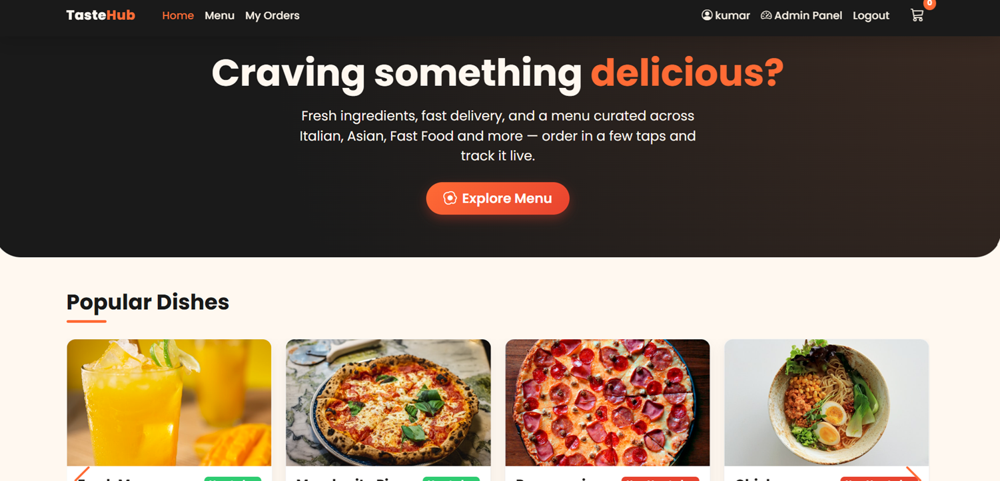
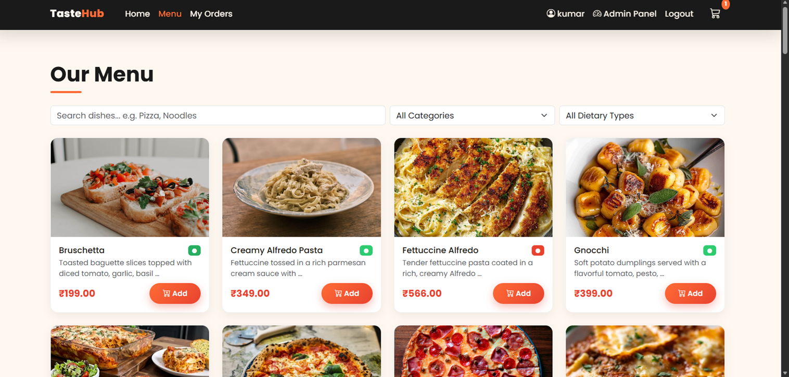
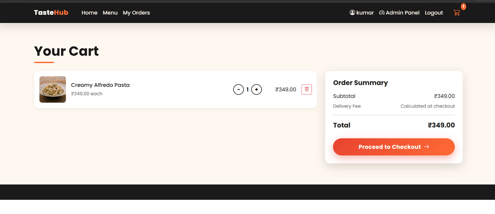
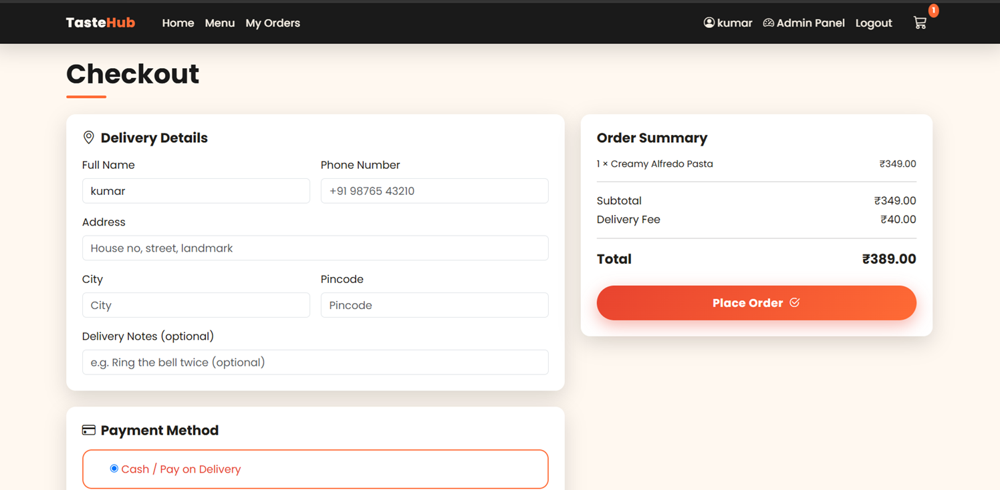
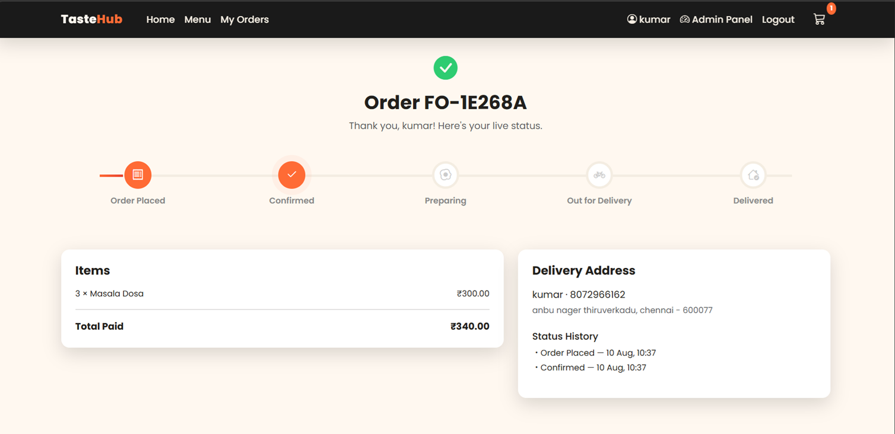

<div align="center">

# 🍽️ TasteHub — Food Ordering System

### A full-stack food ordering web application built with Django

*Browse a curated menu, add dishes to a live cart, check out with a simulated payment gateway, and track your order in real time.*


</div>

---

## ✨ Overview

**TasteHub** is a portfolio-grade food ordering platform inspired by apps like
Zomato and Swiggy — built to demonstrate real-world full-stack skills: complex
user flows, relational database design, session/cart state management, and a
simulated real-time order tracking experience.

---

## 🚀 Features

- 🍕 **Dynamic Menu** — dishes categorized by cuisine (Italian, Asian, Fast Food, Desserts, Beverages) and dietary type (Veg / Vegan / Non-Veg), with search and filters
- 🛒 **Live Cart** — add, remove, and adjust quantities with instant AJAX updates and animated "flying to cart" micro-interactions
- 📝 **Checkout** — delivery address form with live order summary
- 💳 **Simulated Payment Gateway** — Card / UPI / Cash on Delivery, with a mock secure-payment flow and processing spinner
- 📍 **Live Order Tracking** — a visual timeline: *Placed → Confirmed → Preparing → Out for Delivery → Delivered*
- 🔐 **Admin Dashboard** — restaurant managers can add/edit menu items, toggle availability, and update live order status, all from Django's secure admin panel
- 🎨 **Polished UI** — Bootstrap 5 responsive layout, Swiper.js carousel for featured dishes, Anime.js micro-interactions, custom-styled buttons and loading spinners

---

## 🛠️ Tech Stack

| Layer | Technology |
|---|---|
| Backend | Django (Python) |
| Database | SQLite (dev) / MySQL (production-ready config included) |
| Frontend | HTML5, CSS3, JavaScript (ES6+) |
| UI Framework | Bootstrap 5 |
| Animations | Anime.js |
| Carousel | Swiper.js |
| Icons | Bootstrap Icons |

---
## 📸 Screenshots

### Homepage


### Menu


### Cart


### Checkout


### Order Tracking


---

## 📂 Project Structure
foodorder/
├── accounts/ → user auth & profiles
├── menu/ → categories & dishes
├── cart/ → shopping cart logic
├── orders/ → checkout, payment, tracking
├── templates/ → all HTML pages
├── static/ → CSS, JS, images
└── media/ → uploaded food images

---

## ⚙️ Getting Started

```bash
# Clone the repository
git clone https://github.com/madhankumar6161-web/tastehub-food-ordering-django-.git
cd tastehub-food-ordering-django-
# Create & activate a virtual environment
python -m venv venv
venv\Scripts\activate      # Windows
source venv/bin/activate   # macOS/Linux

# Install dependencies
pip install -r requirements.txt

# Set up the database
python manage.py migrate
python manage.py seed_menu

# Create an admin account
python manage.py createsuperuser

# Run the development server
python manage.py runserver
```

Visit **http://127.0.0.1:8000/** for the storefront, and **http://127.0.0.1:8000/admin/** for the restaurant manager dashboard.

Full setup instructions (including MySQL configuration) are in [`SETUP.md`](SETUP.md).

---

## 🗺️ Roadmap

- [ ] Real-time order updates via Django Channels (WebSockets)
- [ ] Integration with a live payment gateway (Razorpay/Stripe)
- [ ] Customer ratings & reviews per dish
- [ ] Order history analytics dashboard for managers

---

## 📄 License

This project is open source and available under the [MIT License](LICENSE).

---

<div align="center">

Built with ❤️ as a full-stack portfolio project

</div>